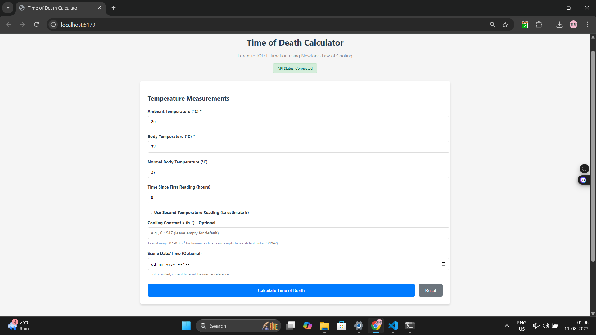
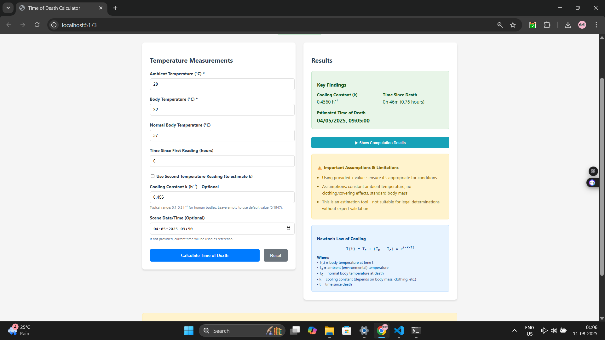

## Screenshots

### Main Interface


### Results Screen



# Time of Death Calculator

A production-ready forensic application implementing Newton's Law of Cooling for time of death estimation, built with Java 21, Spring Boot 3.x, and React with Vite.

## 📋 Overview

This application provides a complete Time of Death (TOD) calculator for forensic analysis using Newton's Law of Cooling formula:

```
T(t) = Te + (T0 - Te) × e^(-k×t)
```

**Where:**
- `T(t)` = body temperature at time t
- `Te` = ambient (environmental) temperature  
- `T0` = normal body temperature at death (default 37°C)
- `k` = cooling constant (h⁻¹)
- `t` = time since death (hours)

## 🚀 Features

### Backend (Spring Boot)
- **REST API** with POST `/api/tod/estimate` endpoint
- **Dual calculation modes**: Single reading with provided k, or two readings for k estimation
- **Comprehensive validation** with detailed error messages
- **Mathematical transparency** with step-by-step calculation display
- **Unit tests** for core calculation logic
- **CORS support** for local development

### Frontend (React + Vite)
- **Responsive form** with real-time validation
- **Two-reading support** with automatic k estimation
- **Results visualization** with expandable computation details
- **Error handling** with user-friendly messages
- **Educational disclaimers** about model limitations

### Mathematical Features
- **K estimation from two readings**: `k = -(1/Δt) × ln(R2/R1)`
- **Time calculation**: `t = -(1/k) × ln((T(t)-Te)/(T0-Te))`
- **Comprehensive validation** of temperature ranges and ratios
- **Warning system** for edge cases and high uncertainty scenarios

## 🛠️ Prerequisites (Windows)

Before running the application, ensure you have:

1. **Java 21** - [Download from Oracle](https://www.oracle.com/java/technologies/downloads/#java21)
2. **Maven 3.6+** - [Download from Apache Maven](https://maven.apache.org/download.cgi)
3. **Node.js 18+ & npm** - [Download from Node.js](https://nodejs.org/)
4. **Git** (optional) - For cloning the repository

Verify installations:
```bash
java -version    # Should show Java 21
mvn -version     # Should show Maven 3.6+
node -version    # Should show Node 18+
npm -version     # Should show npm 8+
```

## 🚀 Quick Start (Windows)

### Option 1: Using Batch Scripts (Recommended)

1. **Extract** the `tod-calculator.zip` file
2. **Open two Command Prompt windows**

**Terminal 1 - Backend:**
```cmd
cd tod-calculator\scripts
run-backend.bat
```

**Terminal 2 - Frontend:**
```cmd
cd tod-calculator\scripts  
run-frontend.bat
```

### Option 2: Manual Setup

**Backend Setup:**
```cmd
cd tod-calculator\backend
mvn clean spring-boot:run
```

**Frontend Setup (in new terminal):**
```cmd
cd tod-calculator\frontend
npm install
npm run dev
```

## 🌐 Access the Application

- **Frontend**: http://localhost:5173
- **Backend API**: http://localhost:8080
- **API Health Check**: http://localhost:8080/api/tod/health

## 📝 API Usage Examples

### Example 1: Single Reading with Provided k

**Request:**
```json
POST /api/tod/estimate
{
    "ambientTempC": 20.0,
    "bodyTempC": 32.0,
    "timeSinceFirstReadingHours": 0.0,
    "normalBodyTempC": 37.0,
    "k": 0.1947
}
```

**Response:**
```json
{
    "k": 0.1947,
    "timeSinceDeathHours": 5.23,
    "estimatedTimeOfDeath": "2024-01-15T14:30:00",
    "steps": [
        "Newton's Law of Cooling: T(t) = Te + (T0 - Te) * e^(-k*t)",
        "Where: T0 = 37.0°C (normal body temp), Te = 20.0°C (ambient temp)",
        "Using provided cooling constant k = 0.1947 h⁻¹",
        "Time since death calculation:",
        "t = -(1/k) * ln((T1 - Te)/(T0 - Te)) + time_to_first_reading",
        "t = -(1/0.1947) * ln((32.0 - 20.0)/(37.0 - 20.0)) + 0.0",
        "t = 5.23 hours"
    ],
    "warnings": [
        "Using provided k value - ensure it's appropriate for conditions",
        "Assumptions: constant ambient temperature, no clothing/covering effects, standard body mass",
        "This is an estimation tool - not suitable for legal determinations without expert validation"
    ]
}
```

### Example 2: Two Readings for k Estimation

**Request:**
```json
POST /api/tod/estimate
{
    "ambientTempC": 20.0,
    "bodyTempC": 34.0,
    "timeSinceFirstReadingHours": 0.0,
    "normalBodyTempC": 37.0,
    "secondReading": {
        "bodyTempC": 32.0,
        "deltaHoursFromFirst": 1.0
    }
}
```

**Response includes k estimation:**
```json
{
    "k": 0.2231,
    "timeSinceDeathHours": 3.89,
    "estimatedTimeOfDeath": "2024-01-15T16:04:00",
    "steps": [
        "Using two readings to estimate k:",
        "T1 = 34.0°C at t1, T2 = 32.0°C at t2 (Δt = 1.0 hours)",
        "R1 = (T1 - Te)/(T0 - Te) = 0.8235",
        "R2 = (T2 - Te)/(T0 - Te) = 0.7059",  
        "k = -(1/Δt) * ln(R2/R1) = 0.2231 h⁻¹",
        "t = 3.89 hours"
    ]
}
```

## 🧪 Running Tests

**Backend Unit Tests:**
```cmd
cd tod-calculator\backend
mvn test
```

**Test Coverage Includes:**
- K estimation from two readings
- Time since death calculation with given k
- Edge cases (T≈Te, invalid inputs)
- Controller endpoint validation
- Error handling scenarios

## ⚙️ Configuration

### Backend Configuration

**Port Configuration** (`backend/src/main/resources/application.properties`):
```properties
server.port=8080
```

**CORS Configuration** (for different frontend ports):
```java
@CrossOrigin(origins = {"http://localhost:5173", "http://localhost:3000"})
```

### Frontend Configuration

**API Base URL** (`frontend/.env`):
```env
VITE_API_BASE_URL=http://localhost:8080
```

**Proxy Configuration** (`frontend/vite.config.js`):
```javascript
server: {
  port: 5173,
  proxy: {
    '/api': {
      target: 'http://localhost:8080',
      changeOrigin: true,
      secure: false,
    }
  }
}
```

## 📊 Mathematical Model & Validation

### Newton's Law of Cooling

The application implements the standard Newton's cooling formula used in forensic pathology:

1. **Single Reading Method**: Use provided or default k value
2. **Two Reading Method**: Estimate k = -(1/Δt) × ln(R2/R1) where R = (T-Te)/(T0-Te)

### Input Validation Ranges

- **Ambient Temperature**: -30°C to 50°C
- **Body Temperature**: 0°C to 45°C  
- **Normal Body Temperature**: 35°C to 42°C (default 37°C)
- **Cooling Constant k**: 0.001 to 5.0 h⁻¹ (typical human range: 0.1-0.3)

### Warnings Generated

- Body temperature close to ambient (< 2°C difference)
- Estimates > 24 hours (reduced accuracy)
- Non-standard normal body temperatures
- Unreasonable k values

## 🚨 Important Forensic Limitations

This calculator demonstrates Newton's Law of Cooling principles but has important limitations:

### **Physical Assumptions:**
- Constant ambient temperature
- Standard body mass and composition
- No clothing or covering effects
- Uniform body temperature distribution
- No external heat sources or airflow

### **Real-World Factors Not Modeled:**
- Body size, weight, and composition variations
- Clothing, bedding, or wrapping materials  
- Environmental factors (humidity, air movement)
- Cause of death effects on cooling rate
- Non-constant ambient temperatures
- Location of temperature measurement

### **Professional Usage:**
- **Educational tool only** - not for official forensic determinations
- Requires expert validation for legal applications
- Should be used alongside other PMI estimation methods
- Consider consulting forensic pathologists for real cases

## 🏗️ Project Structure

```
tod-calculator/
├── backend/                    # Spring Boot API
│   ├── src/main/java/com/forensics/todbackend/
│   │   ├── TodBackendApplication.java
│   │   ├── controller/TodController.java
│   │   ├── service/TodService.java
│   │   ├── dto/              # Data Transfer Objects
│   │   └── exception/        # Error handling
│   ├── src/test/java/        # Unit tests
│   └── pom.xml              # Maven dependencies
├── frontend/                  # React application
│   ├── src/
│   │   ├── App.jsx          # Main component
│   │   ├── components/      # UI components
│   │   └── api.js          # API service
│   ├── package.json
│   └── vite.config.js
├── scripts/                  # Windows batch files
│   ├── run-backend.bat
│   ├── run-frontend.bat
│   └── package-zip.bat
└── README.md
```

## 🔧 Development Notes

### Backend (Spring Boot)
- **Group ID**: com.forensics  
- **Artifact ID**: tod-backend
- **Java Version**: 21
- **Spring Boot Version**: 3.2.0
- **Key Dependencies**: spring-boot-starter-web, spring-boot-starter-validation, lombok

### Frontend (React)
- **Build Tool**: Vite
- **Language**: JavaScript (no TypeScript)
- **Key Dependencies**: React 18, axios for API calls
- **Styling**: Inline CSS for simplicity

## 📦 Building for Production

### Create Distribution ZIP:
```cmd
cd tod-calculator\scripts
package-zip.bat
```

This creates `tod-calculator.zip` containing the complete source code.

### Manual Build:
```cmd
# Backend JAR
cd backend
mvn clean package

# Frontend build
cd ../frontend  
npm run build
```

## 🐛 Troubleshooting

### Common Issues:

**1. Port Already in Use:**
- Backend: Change `server.port` in `application.properties`
- Frontend: Change port in `vite.config.js`

**2. CORS Errors:**
- Verify CORS origins in `TodController.java`
- Check proxy configuration in `vite.config.js`

**3. Java Version Issues:**
- Ensure Java 21 is installed and `JAVA_HOME` is set
- Verify with `java -version`

**4. Maven Issues:**
- Ensure Maven is in PATH
- Try `mvn clean install` to refresh dependencies

**5. npm Issues:**
- Delete `node_modules` and run `npm install` again
- Check Node.js version compatibility

## 📚 Educational Resources

### Newton's Law of Cooling in Forensics:
- Henssge's nomogram method
- Marshall-Hoare double exponential model  
- Temperature-based PMI estimation accuracy studies

### Mathematical Background:
- Exponential decay functions
- Logarithmic transformations
- Error propagation in indirect measurements

### Forensic Science Context:
- Algor mortis (body cooling after death)
- Postmortem interval (PMI) estimation methods
- Early vs. late postmortem phase considerations

## 📄 License & Disclaimer

This software is provided for educational and research purposes. The developers make no warranties about the accuracy of results. Professional forensic analysis should always be conducted by qualified experts using validated methods and multiple estimation techniques.

## 🤝 Support

For technical issues:
1. Check this README for common solutions
2. Verify all prerequisites are properly installed  
3. Ensure correct port configurations
4. Review browser console for detailed error messages

---

**Remember**: This is an educational demonstration of Newton's Law of Cooling applications in forensics. Real forensic investigations require comprehensive analysis by qualified professionals using multiple validated methodologies.
